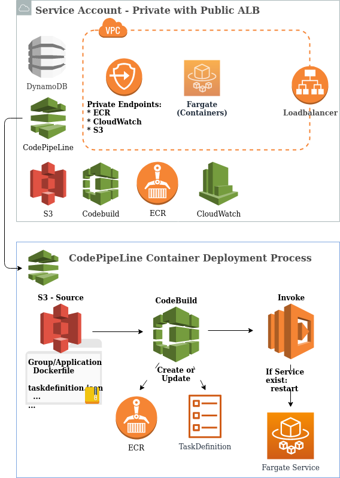

 
# Webhosting MVP 20200211
Fully automated deployment to host a Website on AWS Fargate. Docker files are in ./docker-codebuild.

It should work as-is, as a highly over-engineered example of how to deploy a single container ;). Further instructions on how to fully exploit this solution -- and why it's awesome -- will follow soon.

## Design



## Quickstart 
Based on [AWS Workspace environment](https://github.com/LINKIT-Group/aws-workspace)
```
# ensure AWS credentials are in the HOST environment
# change the variables within brackets
export AWS_SECRET_ACCESS_KEY="${YOUR_AWS_SECRET_ACCESS_KEY}"
export AWS_ACCESS_KEY_ID="${YOUR_AWS_ACCESS_KEY_ID}"

# setting (default) region via environment is highly recommended
export AWS_DEFAULT_REGION="${YOUR_AWS_DEFAULT_REGION}"

# option A -- add when security credentials are temporary
# export AWS_SESSION_TOKEN="${YOUR_AWS_SESSION_TOKEN}"

# option B -- add to get new (temporary) credentials via assume-role
# export AWS_ROLE_ARN="${YOUR_AWS_ROLE_ARN}"

# start shell
make shell

# get code
[ ! -d cloudformation-solutions ] && git clone https://github.com/LINKIT-Group/cloudformation-solutions.git 

# change directory
cd cloudformation-solutions

# deploy
make deploy template=Webhosting/Classic/template.yaml

# get coffee and/ or watch things get build in AWS Console
# should take about 10 minutes, after which you can browse to the ALB URL (check EC2/Loadbalancer)

# cleanup
make delete template=Webhosting/Classic/template.yaml
```

